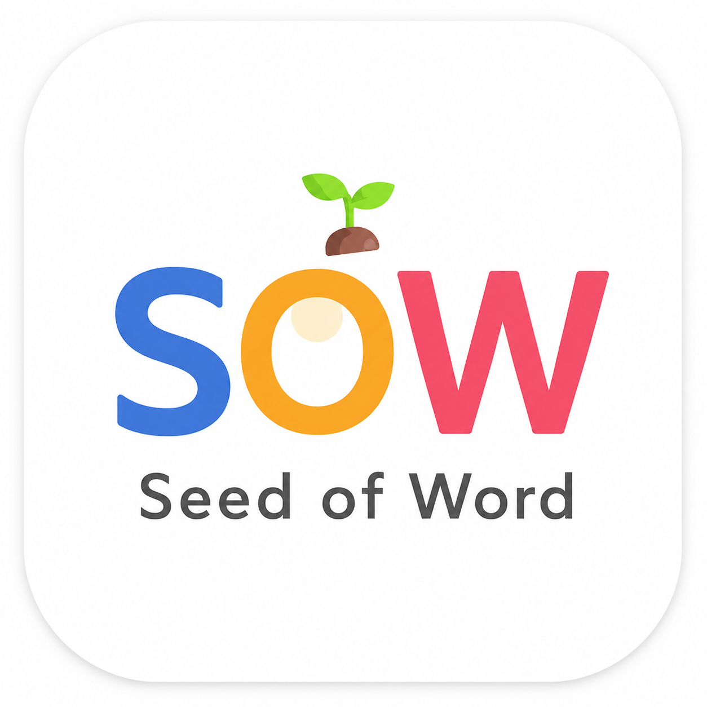

# SOW 페이지 셸 프로토타입

> 📍 **문서가 여러 개라 헷갈리면 `PROJECT_MAP.md`부터 보세요** — 뭘 고치려면 어느 파일만 보면 되는지 정리돼 있어요.

`SOW_구조설계.md` 설계를 실제로 동작하는 코드로 만든 프로토타입입니다.

> **v5.3 업데이트**: 직접 그렸던 잎사귀 아이콘을 **공식 SOW 로고**로 교체했습니다(파랑/주황/빨강 "SOW" + 새싹). favicon부터 홈 화면 아이콘, README 배너까지 전부 반영. 상세는 `SOW_구조설계.md` 22-2절 참고.

> **v5.4 업데이트**: **`NETLIFY_SETUP.md`** 신규 — GitHub 저장소를 Public으로 안 바꿔도 무료로 배포할 수 있는 방법이에요(Private 유지). HTTPS도 자동으로 붙어서 PWA(홈 화면 설치)가 완전하게 동작해요. `DEPLOY.md`(GitHub Pages)의 대안입니다.

> **v5.5 업데이트**: "나의 성경읽기"(달력/성경지도)가 이제 성경묵상 탭에 들어가자마자 바로 보여요 — 예전엔 코스를 먼저 골라야만 보였어요. 그리고 실제 배포 후 발견된 Supabase 프로젝트 URL 오타를 고쳐서 로그인이 정상 동작합니다("Failed to fetch" 오류 해결).

> **v5.6 업데이트**: **웹과 모바일 레이아웃을 분리**했어요. 넓은 화면(1024px 이상)에서는 상단 가로 탭 대신 **왼쪽 세로 사이드바**로 바뀌고 본문도 760px→900px로 넓어져서, 예전처럼 양옆에 텅 빈 여백이 크게 남지 않아요. 상세는 `SOW_구조설계.md` 23절 참고.

> **v5.7 업데이트**: 모바일/태블릿 **하단 탭바를 햄버거 드로어 메뉴로 전환**했어요(사용자 제공 참고 앱 반영) — 상단 햄버거(☰)를 누르면 왼쪽에서 메뉴가 슬라이드인하고, 그 안에 4개 모듈뿐 아니라 **"📅 나의 성경읽기" · "👥 우리 그룹" 바로가기 · 로그인**이 한 목록으로 같이 있어요. 데스크톱 사이드바랑 완전히 같은 목록을 공유해서, 웹이든 앱이든 로그인/달력/그룹이 항상 메뉴 안에 있어요. 폰트도 세리프체를 다 빼고 산세리프(Pretendard) 하나로 통일했습니다(Claude 웹/앱 타이포그래피 참고). 상세는 `SOW_구조설계.md` 23절 참고.

> **v5.8 업데이트**: "본문 바로 가기"(구약/신약+책/장 선택)가 이제 **접이식**이에요 — 기본은 "🔎 본문 바로 가기" 작은 버튼 하나만 보이고, 눌러야 펼쳐져요. 화면 공간을 너무 차지한다는 피드백을 반영했어요. 자유코스·하루한장·1년1독 세 코스 다 적용됩니다. 상세는 `SOW_구조설계.md` 19절 참고.

> **v6.0 업데이트**: **메뉴 아코디언 + "나의 성경읽기" 전용 화면**이 생겼어요. 성경묵상 옆 화살표(▸/▾)를 누르면 그 아래 코스 4개가 메뉴 안에서 바로 펼쳐져요(코스 화면까지 안 가도 됨). "📅 나의 성경읽기"는 코스/묵상 내용이랑 완전히 분리된 전용 화면이 됐고, 맨 위에 **오늘의 활동 요약**(오늘 기록 여부·연속 기록일·이번 달 기록일수·전체 읽은 장수)이 통계 카드로 추가됐어요(사용자 제공 대시보드 참고 반영). 상세는 `SOW_구조설계.md` 24절 참고.

> **v6.1 업데이트**: 말씀묵상 화면의 글자 크기를 왼쪽 메뉴 수준 이상으로 전체적으로 키웠어요(본문 참조/걸음 제목/질문 제목/안내문구/입력창/아이콘 배지 전부).

> **v6.2 업데이트**: 국어 서브탭을 **어휘 / 한자 / 나눔(글쓰기)** 3개로 재구성했어요 — 예전엔 어휘·한자가 한 탭에 합쳐져 있고 토론·글쓰기는 빈 틀이었는데, 이제 3개 다 독립된 탭이고 나눔(글쓰기)엔 실제 콘텐츠가 채워져 있어요. 상세는 `SOW_구조설계.md` 25절, 콘텐츠 작성법은 `CONTENT_GUIDE.md` 템플릿 B 참고.

> **v7.0 업데이트**: **국어/언어/성경관련 지식의 버그를 고쳤어요** — 예전엔 성경묵상에서 하루한장·1년1독·자유코스를 고르면 국어 탭이 아예 깨졌는데(존재하지 않는 경로), 이제 콘텐츠를 "실제 성경 책/장" 기준으로 찾도록 구조를 바꿔서 어떤 코스를 고르든 정상 동작해요. **왼쪽 메뉴에 국어/언어/성경관련 지식도 성경묵상처럼 화살표(▸/▾)로 서브탭을 바로 펼쳐볼 수 있어요.** 국어의 어휘/한자 탭 글자 크기도 성경묵상과 동일하게 키웠습니다. 상세는 `SOW_구조설계.md` 26절 참고.

## 로컬에서 바로 미리보기

Windows에서 클릭 단위로 따라 하는 자세한 방법은 **`WINDOWS_PREVIEW.md`**를 보세요.

(요약) 이 폴더 안에서:
```bash
python3 -m http.server 8000   # Windows는 python3 대신 py 또는 python 사용 — WINDOWS_PREVIEW.md 참고
```
브라우저에서 `http://localhost:8000/sow/read/index.html?book=john&step=1` 을 열면 바로 확인할 수 있어요. GitHub에 올리지 않아도 됩니다 — `fetch()`가 `file://`로는 안 열려서 반드시 이렇게 로컬 웹서버로 띄워서 봐야 해요.

## 구조

```
/content/_module-registry.json    # 최상위 4개 모듈(성경묵상/국어/언어/성경관련 지식)
/content/meditation/...           # 성경묵상 — 코스별(_track-registry.json), 걸음별 콘텐츠
/content/korean|world-languages|explore/...  # 성경묵상 코스를 자동으로 따라감 (SOW_구조설계.md 13절)
/content/bible/...                 # 66권 라이브러리 + 역본 정보 (godpia 연동용)
/app/css/shell.css                 # 공용 스타일 — 모든 페이지가 1벌만 공유
/app/js/shell.js                   # 공용 렌더링 엔진 — 레지스트리 읽어서 탭/콘텐츠 그림
/app/js/voice-text-input.js        # 음성 입력 컴포넌트
/app/js/persist.js                 # 입력 자동저장/초기화
/app/js/session-toolbar.js         # 오늘의 기록 툴바(달력/저장/새로고침)
/app/js/bible-link.js              # 성경 보기 위젯(역본 선택 + godpia)
/sow/read/index.html               # 모든 걸음이 함께 쓰는 단일 페이지 (?book=&step=&module= 로 지정)
```
전체 폴더 구조와 각 파일의 역할은 `SOW_구조설계.md`, 뭘 고치려면 어느 파일을 보면 되는지는 `PROJECT_MAP.md`에 정리돼 있습니다.

## 검증된 수치 (v1.x 초기 측정, 지금도 유효한 방향성)

| | 기존 (`SEED-OF-WORD-main`) | 신규 |
|---|---|---|
| 걸음 1개 페이지 크기 | 581,188 bytes | 페이지 자체가 아예 없음(단일 템플릿, v3.5) |
| 42걸음 전체 예상 용량 | 약 23.3MB | 공용 셸 1벌 + 콘텐츠 JSON만 |

## 새 걸음(예: 요한복음 2걸음) 추가하는 법

**페이지 파일은 안 만들어도 됩니다** (v3.5부터, `SOW_구조설계.md` 12절). `CONTENT_GUIDE.md` 템플릿대로 콘텐츠 JSON만 채우면 끝:

1. `content/meditation/elementary/steps/john/2.json` 등 필요한 콘텐츠 채우기
2. 저장하면 바로 `sow/read/index.html?book=john&step=2`로 접근 가능

셸 코드(`shell.js`, `shell.css`, 그 외 `app/js/*.js`)는 전혀 건드리지 않습니다.

## 배포 시 주의

- 지금은 `/content`, `/app`을 사이트 루트 기준 절대경로로 fetch합니다.
- 사이트를 `/sow/` 하위 경로에 두고 싶다면, `sow/read/index.html`의 `SOW_CONTEXT`에 `basePath: "/sow"`를 추가하면 됩니다 — `shell.js`가 이미 이 옵션을 지원합니다.

## 아직 안 한 것 (다음 단계)

- **그룹(기도정원/축복의 말/그룹 관리) Supabase 연동** — 지금은 UI만 있고 실제 저장은 안 됨. 설계는 `GROUP_SHARING_DESIGN.md`
- 이메일 매직링크 로그인 연동
- 국어/언어의 나머지 언어(중국어/일본어) 실제 문장 콘텐츠 채우기
- 요한복음 2~42걸음 데이터 채우기 (`CONTENT_GUIDE.md` 참고)
- 퀴즈(word/sentence quiz) 렌더러 — 콘텐츠 스키마에 자리만 있고 셸에는 아직 없음
